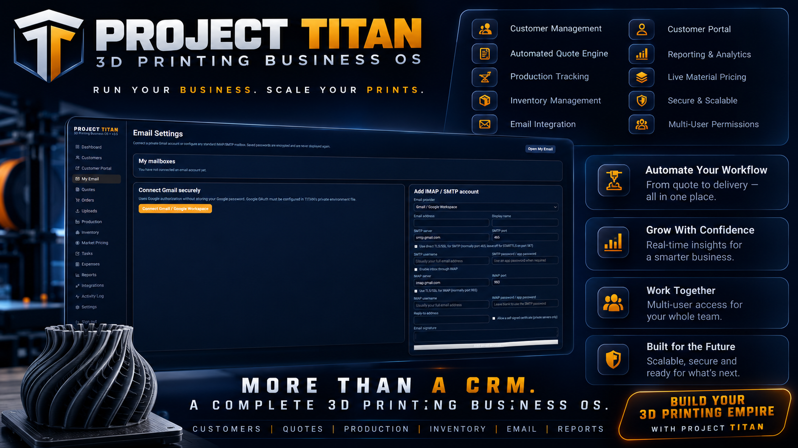
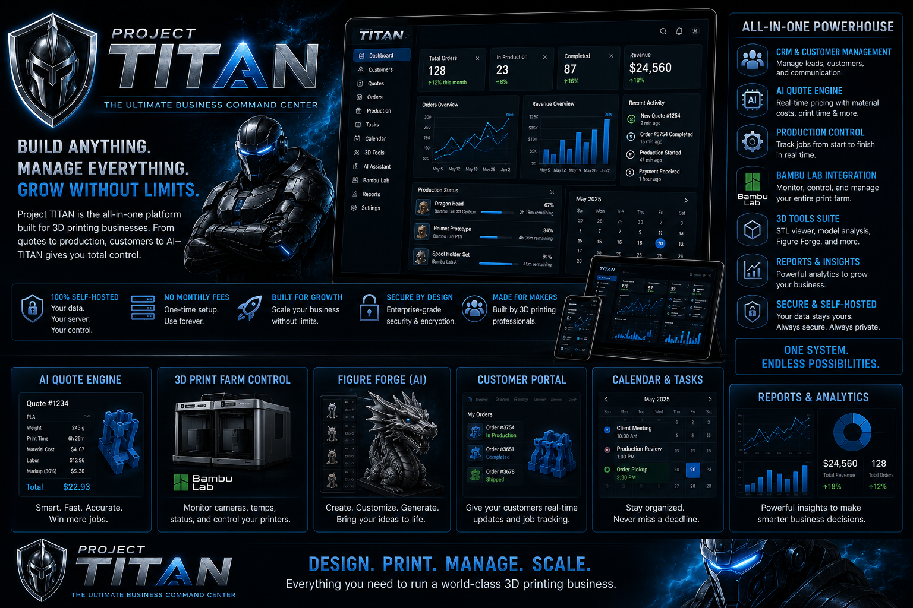

# Project TITAN Version 4.0

Project TITAN is a self-hosted 3D-printing CRM and business operating platform.

## Quick Install

### Ubuntu

```bash

sudo apt update
sudo apt install -y git curl ca-certificates unzip openssl

git clone https://github.com/jrmediagroupvan/Project-Titan.git
cd Project-Titan

sudo chown -R "$(id -un):$(id -gn)" .

chmod +x install.sh install/*.sh scripts/titan scripts/*.sh

sudo ./install.sh

```

### Windows

Run:

```text
install\install-windows.cmd
```

as Administrator. Docker Desktop may require a first-run confirmation or restart.

## Validate Before Release

```bash
npm ci
npm run validate
npm test
```

## Safe Update

```bash
sudo ./scripts/update.sh
```

See [`RELEASE-v4.0.md`](RELEASE-v4.0.md) for the complete release summary.

---

# Project TITAN

<p align="center">
  
</p>

<p align="center">
  <strong>Project TITAN Version 4.0</strong><br>
  Self-hosted CRM, quoting, production, email, AI, inventory, security, and operations platform for 3D-printing businesses.
</p>

<p align="center">
  
  
  
  
  
  
</p>

> **Build Anything. Manage Everything. Powered by AI.**

Project TITAN combines customer management, quoting, email, file handling, production, inventory, reporting, permissions, security, and self-hosted business operations into one platform.

This repository uses generic example values only. Never commit passwords, API keys, OAuth secrets, customer files, database exports, mailbox credentials, printer access codes, or private configuration.

---

## What’s New in Version 4.0

- Responsive interface for desktop, Android, iPhone, and tablets
- Professional light and dark themes
- Mobile hamburger navigation
- Optional QR-code two-step verification
- Dedicated Security Center
- Trusted-device management
- Single-use recovery codes
- Login history
- One-click GitHub updater
- Automatic rollback protection
- Enhanced TITAN AI
- AI STL Developer improvements
- TITAN Figure Forge framework
- Improved Bambu integration
- Better dashboard widgets
- Faster Docker deployment
- Improved permissions and audit logging

---

## Documentation

| Guide | Description |
|---|---|
| [Official Repository](docs/REPOSITORY.md) | Correct GitHub URL, clone command, branch usage, and Git remote setup |
| [Installation](docs/INSTALLATION.md) | Ubuntu, Docker, UGREEN, TrueNAS, Unraid, Synology, QNAP, and Docker Desktop |
| [Configuration](docs/CONFIGURATION.md) | `.env`, ports, database, storage, URLs, secrets, providers, and integrations |
| [CRM & Customers](docs/CRM.md) | Customer records, assignments, uploads, deletion, portal access, and audit history |
| [Quotes & Pricing](docs/QUOTE-ENGINE.md) | 13% default markup, materials, machine rates, tax, slicing data, and quote workflow |
| [Email](docs/EMAIL.md) | Gmail OAuth, IMAP, SMTP, private mailboxes, shared mailboxes, and Email-to-Quote |
| [TITAN AI](docs/AI.md) | AI Assistant, provider setup, permissions, private keys, research, and approval gates |
| [AI STL Developer](docs/AI-STL-DEVELOPER.md) | Parametric model generation, validation, previews, revisions, and exports |
| [TITAN Figure Forge](TITAN-FIGURE-FORGE.md) | AI-assisted figurine planning, generation workflow, revisions, and exports |
| [Uploads & 3D Files](docs/UPLOADS.md) | STL, 3MF, STEP, OBJ, G-code, documents, previews, and secure storage |
| [Production & Printers](docs/PRODUCTION.md) | Production jobs, printer assignments, slicing, Bambu bridge, and Bambuddy |
| [Bambu Integration](BAMBU-INTEGRATION.md) | Printer configuration, cameras, job data, status, and connectivity |
| [Users & Permissions](docs/PERMISSIONS.md) | Roles, feature access, actions, customer restrictions, and approvals |
| [Security Center](SECURITY-2FA.md) | Optional QR-based 2FA, trusted devices, recovery codes, and login history |
| [Mobile Interface](MOBILE-FIX-v4.4.1.md) | Responsive layouts, hamburger navigation, touch controls, and safe-area support |
| [Operations & Reporting](docs/OPERATIONS.md) | Dashboards, tasks, calendar, expenses, KPIs, reports, and activity logs |
| [One-Click Updates](ONE-CLICK-UPDATES.md) | Backup, staged deployment, migrations, health checks, and automatic rollback |
| [Backup & Restore](docs/BACKUP-RESTORE.md) | Backup commands, restore planning, persistent data, and validation |
| [Security](docs/SECURITY.md) | Secret handling, HTTPS, access control, audit logs, and deployment hardening |
| [Troubleshooting](docs/TROUBLESHOOTING.md) | Docker, Prisma, email, uploads, builds, updates, and common errors |
| [Planned Features](docs/PLANNED-FEATURES.md) | Clearly labeled roadmap items not included in the current release |
| [Roadmap](docs/ROADMAP.md) | Planned release direction and long-term product vision |
| [Changelog](docs/CHANGELOG.md) | Version history and release summary |

---

## Current Core Features

### CRM and Customer Management

- Customer and company profiles
- Contact details, notes, files, tasks, quotes, orders, payments, and shipments
- Assigned-customer access for restricted users
- Customer portal links with expiration and revocation
- Permission-controlled editing and deletion
- Audit records for sensitive actions
- Responsive customer views for desktop and mobile
- Improved activity timelines and record navigation

### Quotes and Pricing

- Material, machine time, setup fees, minimum charges, tax, and waste allowances
- Inventory and market-price lookup
- Default **13% markup**
- Manual price overrides with permissions
- Saved Bambu slicing weight and print-time data
- Draft quote workflow before customer delivery
- Mobile-friendly quote editing and review
- Improved pricing summaries and status badges

### Email

- Private email configuration per user
- Gmail and Google Workspace OAuth
- IMAP and SMTP
- Shared team mailboxes with explicit read/send access
- Inbox, compose, reply, CC, signatures, and deletion permissions
- Email-to-Quote draft workflow
- Responsive email layout for desktop and mobile
- Permission-aware mailbox visibility

### TITAN AI

- Shared or private AI provider configuration
- Permission-aware CRM context
- AI chat and image permissions
- Live web research when configured
- Quote calculations, file inspection, planning, and writing
- Approval-gated actions
- Private conversation history
- Improved responsive AI interface
- Better CRM-aware prompts and workflow assistance

### AI STL Developer

- Plain-language part descriptions
- Validated geometry plans
- Binary STL generation
- Revisions using follow-up instructions
- Interactive 3D previews
- Dimensions, triangle count, and revision history
- Customer-file export with permissions and audit logging
- Improved responsive controls and preview layout

### TITAN Figure Forge

- AI-assisted figurine planning workflow
- Image-guided concept preparation
- Revision tracking
- Export and approval workflow
- Permission-aware access
- Future-ready photo-to-figurine expansion

### Uploads and 3D Files

- STL, 3MF, STEP/STP, OBJ, G-code, images, PDF, TXT, CSV, and ZIP
- Authenticated downloads
- Customer access enforcement
- Persistent Docker storage
- Browser 3D preview
- Bambu slicing workflow
- Responsive file cards and previews
- Improved upload status feedback

### Operations

- Production queue
- Printer records and job assignments
- Inventory and reorder levels
- Tasks and calendar
- Expenses and reports
- Operations dashboard
- Audit trail
- Health, backup, doctor, and update scripts
- Responsive KPI cards
- Improved mobile dashboard layout
- Upcoming events and overdue task visibility
- Better printer and production summaries

### Security and Permissions

- OWNER, ADMIN, MANAGER, STAFF, PRODUCTION, ACCOUNTING, and VIEWER roles
- Feature category assignments
- View, Create, Edit, and Delete controls
- Assigned-customer restrictions
- Server-side permission enforcement
- Encrypted integration credentials
- OWNER-controlled settings and updates
- Optional QR-code two-step verification
- Manual authenticator setup key
- Recovery codes
- Trusted devices
- Login history
- Password-confirmed 2FA disable flow
- Audit events for security actions

---

<p align="center">
  
</p>

---

## Responsive Interface

Project TITAN Version 4.0 is designed to work across desktop, tablet, Android, and iPhone browsers.

### Desktop

- Full navigation sidebar
- Multi-column dashboard
- Wide data tables
- Expanded charts and analytics
- Faster access to common workflows

### Tablet

- Compact navigation
- Two-column KPI layout
- Responsive forms and cards
- Touch-friendly controls

### Mobile

- Hamburger navigation menu
- Slide-out drawer
- Single-column cards
- Full-width forms and buttons
- Scrollable tables and calendars
- iPhone safe-area support
- Android and iPhone portrait/landscape support

---

## Light and Dark Themes

### Light Theme

- White content surfaces
- Clean slate backgrounds
- Blue TITAN accent system
- High-contrast text
- Professional business dashboard appearance

### Dark Theme

- Deep navy and charcoal surfaces
- Bright blue accent highlights
- Reduced glare
- Consistent card, table, form, and navigation styling

Theme choice can be remembered per user, with support for system theme preference.

---

## Security Center

Two-step verification remains optional for every role.

### QR Authenticator Setup

1. Open **Settings → Security**.
2. Select **Show setup QR code**.
3. Scan the QR code using a supported authenticator app.
4. Enter the generated six-digit code.
5. Save the recovery codes.

Supported apps include:

- Microsoft Authenticator
- Google Authenticator
- 1Password
- Bitwarden
- Authy
- Any compatible TOTP authenticator

The QR code is generated locally inside Project TITAN. The setup secret is not sent to an external QR-code service.

### Security Features

- Optional enable/disable
- Manual setup key
- Recovery codes
- Trusted devices
- Login history
- Password confirmation before disabling
- Audit events for security changes

---

## Dashboard Calendar & Task Upgrade

This update improves the **Operations Dashboard → Upcoming calendar** card.

### Included Improvements

- Shows calendar events occurring during the next **30 days**
- Shows events already in progress
- Shows shared events with no customer or assignee
- Shows events created by or assigned to the signed-in user
- Shows customer events permitted by the current user profile
- Shows order deadlines in the same calendar panel
- Shows open tasks in a dedicated section below calendar events
- Includes overdue tasks and order deadlines with an **OVERDUE** label
- Keeps completed and cancelled tasks out of the dashboard
- Preserves role-based and assigned-customer access controls

This is a dashboard-only update and does not delete or recreate database records.

---

## Quick Start

```bash
git clone https://github.com/jrmediagroupvan/Project-Titan.git
cd Project-Titan
cp .env.example .env
chmod 600 .env
nano .env
sudo docker compose build --no-cache app updater
sudo docker compose up -d postgres redis minio
sudo docker compose run --rm app npx prisma migrate deploy
sudo docker compose run --rm app npx prisma db seed
sudo docker compose up -d --force-recreate
```

Open:

```text
http://SERVER-IP:1200
```

For complete instructions, see [docs/INSTALLATION.md](docs/INSTALLATION.md).

---

<p align="center">
  
</p>

---

## One-Click Update Center

The Owner-only Update Center performs a staged GitHub update.

### Update Workflow

1. Create database, upload, and configuration backups.
2. Download the latest configured GitHub branch into staging.
3. Validate Docker Compose.
4. Run a clean Docker build.
5. Apply Prisma migrations.
6. Activate the validated release.
7. Restart Project TITAN.
8. Run a health check.
9. Roll back source and database automatically if deployment fails.

The updater preserves:

- `.env`
- PostgreSQL data
- Redis data
- MinIO data
- Uploads
- Backups

It does not intentionally remove persistent data during a normal update.

See [`ONE-CLICK-UPDATES.md`](ONE-CLICK-UPDATES.md) for details.

---

## Important Deployment Notes

- Keep `.env` private.
- Use independent random secrets.
- Do not run `docker compose down -v` unless you intentionally want to remove persistent volumes.
- Create a backup before updates.
- Use HTTPS before exposing TITAN outside a trusted private network.
- External providers require their own credentials, billing, approvals, and testing.
- Keep database and storage directories outside the Docker build context.
- Do not commit generated secrets, private keys, or customer information.
- Review Owner and Administrator permissions regularly.

---

## Planned Features

Future ideas are documented separately and explicitly labeled as planned:

- Expanded TITAN Figure Forge workflows
- AI image-to-3D generation
- Native mobile applications
- Multi-company and multi-location operations
- Marketplace synchronization
- Vision-based print monitoring
- Advanced warehouse, barcode, and RFID workflows
- Plugin marketplace

See [docs/PLANNED-FEATURES.md](docs/PLANNED-FEATURES.md).

---

## Update Notes — Dashboard Calendar Visibility

The dashboard now uses one consistent server timestamp per request and a 30-day display window. General shared events, ongoing events, user-created events, assigned events, customer-linked events, overdue tasks, and overdue order deadlines can appear when the signed-in user is authorized to see them.

---

## Support

Before reporting a problem:

```bash
sudo docker compose ps
sudo docker compose logs --tail=200 app
curl http://127.0.0.1:1200/api/health
```

Also review:

```bash
sudo docker compose logs --tail=100 postgres
sudo docker compose logs --tail=100 redis
sudo docker compose logs --tail=100 minio
```

Then review [docs/TROUBLESHOOTING.md](docs/TROUBLESHOOTING.md).

---

## License and Commercial Use

Review the repository license and commercial terms before redistribution, resale, hosted-service use, or publishing modified builds.

Project TITAN Version 4.0  
Designed and maintained as a self-hosted free-to-use platform.
